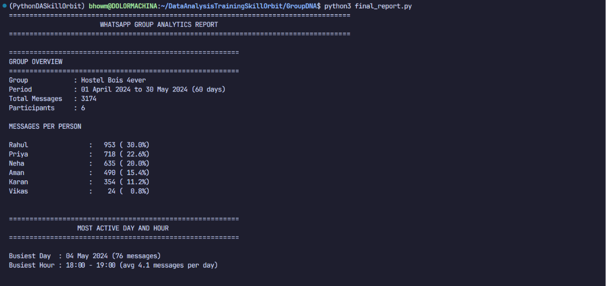
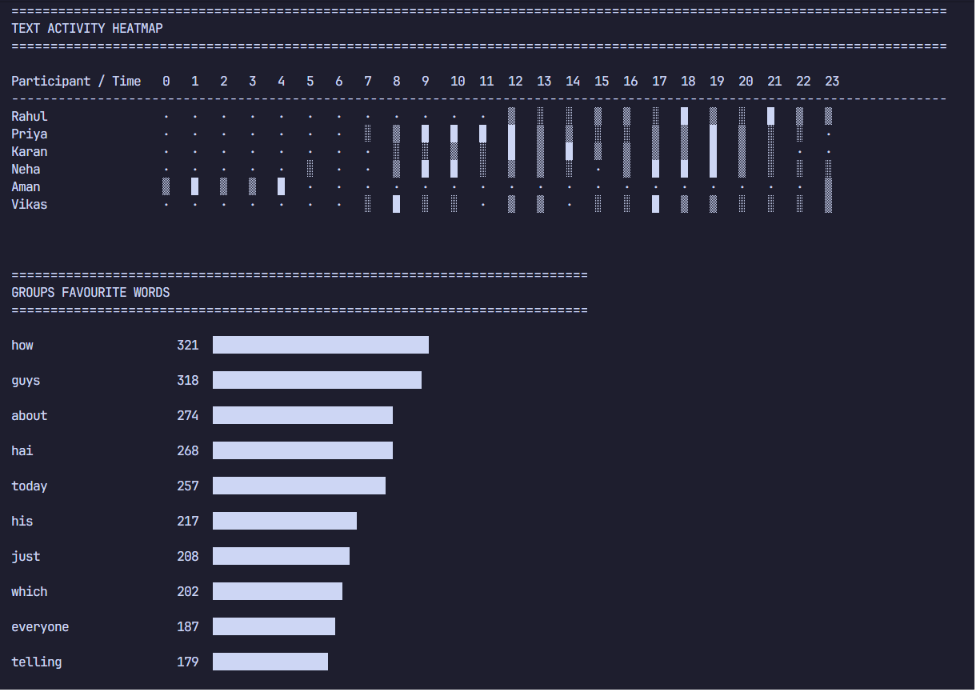
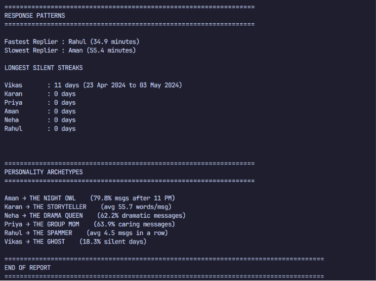

# GroupDNA - WhatsApp Group Analytics using Python and NumPy

## Overview

GroupDNA is a Python-based analytics system that extracts behavioural insights from exported WhatsApp group chats. Rather than simply counting messages, the project transforms a semi-structured chat export into structured data and performs multiple layers of analysis to study communication patterns, activity trends, vocabulary usage, response behaviour and participant personalities.

The project was developed as part of a Data Analytics coursework assignment with the objective of demonstrating the practical application of core Python programming concepts together with NumPy for matrix-based data analysis. Every feature has been implemented using rule-based logic without relying on machine learning or external natural language processing libraries.

---

# Objectives

The primary objectives of this project are to:

- Parse exported WhatsApp chat files into structured Python objects.
- Handle common WhatsApp export edge cases.
- Generate descriptive statistics about the group.
- Identify communication and activity patterns.
- Analyse participant response behaviour.
- Build a NumPy-based activity heatmap.
- Detect frequently used vocabulary.
- Assign one personality archetype to every participant using quantitative rules.
- Produce a comprehensive terminal-based analytics report.

---

# Features

## Feature 1 - Chat Parser

The parser converts an exported WhatsApp chat into structured dictionaries that can be analysed by the remaining modules.

Each parsed message contains:

- Timestamp
- Date
- Time
- Sender
- Message
- Message Type

The parser correctly handles:

- Normal messages
- Multi-line messages
- Deleted messages
- Media messages
- Media messages with captions
- System notifications
- Malformed records

The parser also generates summary statistics including participant count, media messages, deleted messages and malformed entries.

---

## Feature 2 - Group Overview

Generates an overview of the chat containing:

- Chat duration
- Total number of messages
- Number of participants
- Message contribution of every participant
- Percentage contribution of every participant

---

## Feature 3 - Activity Analysis

Analyses overall activity throughout the chat by identifying:

- Most active day
- Most active hour
- Average hourly activity

---

## Feature 4 - Activity Heatmap

A participant × hour matrix is constructed using NumPy.

Rows represent participants.

Columns represent the 24 hours of the day.

Each matrix element stores the number of messages sent by a participant during that hour over the complete chat duration.

The matrix is then converted into a terminal-based heatmap using Unicode shading characters.

```
·   Very Low Activity
░   Low Activity
▒   Medium Activity
█   High Activity
```

---

## Feature 5 - Top Words

The project analyses the vocabulary used throughout the group.

The process includes:

- Converting words to lowercase
- Removing punctuation
- Ignoring stop words
- Counting word frequencies
- Ranking the most frequently used words

The results are displayed using Unicode block characters to produce horizontal frequency bars.

---

## Feature 6 - Response Speed and Silent Streaks

Two behavioural metrics are computed.

### Response Speed

For every participant the project computes the average response time after another participant sends a message.

This identifies:

- Fastest replier
- Slowest replier

### Silent Streak

For every participant the project calculates the longest consecutive sequence of days during which no messages were sent.

This identifies inactive or "ghost" members.

---

## Feature 7 - Personality Archetypes

Each participant is evaluated using quantitative scoring rules.

The project currently identifies the following archetypes:

- The Spammer
- The Group Mom
- The Night Owl
- The Storyteller
- The Drama Queen
- The Ghost
- The Comedian
- The Question Master
- The Problem Solver

For every archetype a numerical score is computed for every participant.

Scores are normalised to a common scale.

Each participant is assigned exactly one archetype corresponding to their highest normalised score.

---

## Feature 8 - Final Report

All analysis modules are combined into a single structured terminal report containing:

- Group Overview
- Activity Analysis
- Activity Heatmap
- Top Words
- Response Patterns
- Personality Archetypes

The report is formatted using aligned columns, Unicode characters and section dividers for readability.

---

# Sample Output (Final Report)

  

# Project Architecture

```
                   WhatsApp Export (.txt)
                            │
                            ▼
                     Chat Parser
                            │
                            ▼
               Structured Message Objects
                            │
        ┌─────────────┬─────────────┬─────────────┐
        ▼             ▼             ▼
 Group Overview   Activity     Vocabulary Analysis
                  Analysis
        │             │             │
        └─────────────┴─────────────┘
                      │
                      ▼
              Response Analysis
                      │
                      ▼
            Personality Archetypes
                      │
                      ▼
               Final Analytics Report
```

---

# Mathematical Techniques Used

The project uses several mathematical and statistical techniques.

## Frequency Counting

Used for:

- Message counts
- Word counts
- Hourly activity
- Daily activity

---

## Percentage Calculation

Participant contribution:

```
Percentage = (Messages Sent / Total Messages) × 100
```

---

## Average Response Time

```
Average Response Time

=

Sum of all response gaps

/

Number of responses
```

---

## Activity Heatmap

A NumPy matrix stores message frequencies.

```
Heatmap[Participant][Hour]
```

---

## Normalisation

Heatmap intensity is computed as

```
Ratio = Cell Value / Maximum Value
```

where the maximum value is the participant's highest hourly message count.

---

## Ranking

Participants are ranked using descending numerical scores for:

- Activity
- Word frequencies
- Response behaviour
- Personality archetypes

---

# Technologies Used

- Python 3
- NumPy
- datetime
- Standard Python Library

No external machine learning libraries or natural language processing libraries have been used.

---

# Project Structure

```
GroupDNA/

│
├── parser.py
├── analysis.py
├── activity_analysis.py
├── heatmap.py
├── top_words.py
├── response_analysis.py
├── archetype.py
├── final_report.py
├── GroupDNADebayanBhowmik.ipynb
├── hostel_bois.txt
├── README.md
└── requirements.txt
```

---

# Installation

Clone the repository.

```
git clone <repository-url>
```

Move into the project directory.

```
cd GroupDNA
```

Install the required package.

```
pip install -r requirements.txt
```

---

# Running the Project

Place an exported WhatsApp chat (.txt) inside the project directory.

Run

```
python final_report.py
```

or

```
python final_report2.py
```

Choose the desired chat file when prompted.

The analytics report will then be generated automatically.

---

# Design Decisions

Several design choices were made during development.

- A rule-based approach was chosen instead of machine learning to ensure complete interpretability.
- NumPy was used specifically for matrix-based analysis where it naturally fits the problem.
- Unicode characters were used instead of plotting libraries to maintain terminal compatibility.
- The parser preserves original message content before performing any analysis.
- Each analysis module was implemented independently to improve modularity and maintainability.

---

# Assumptions

The project assumes that:

- The input file is an exported WhatsApp chat.
- Messages are arranged chronologically.
- Exported timestamps follow a consistent format throughout the chat.
- Participant names remain consistent within the export.

---

# Limitations

Current limitations include:

- No sentiment analysis.
- No emoji analysis.
- No conversation thread detection.
- No multilingual linguistic processing.
- Personality detection is entirely rule-based and should not be interpreted as a psychological assessment.

---

# Future Improvements

Possible future extensions include:

- Emoji analytics
- Word cloud generation
- Network graph of participant interactions
- PDF report generation
- Interactive dashboard
- Time-series visualisations
- Support for additional messaging platforms
- More advanced behavioural metrics

---

# Author

Debayan Bhowmik

Bachelor of Technology (Computer Science and Engineering)

Data Analytics Coursework

---

# License

This project has been developed for academic and educational purposes.
